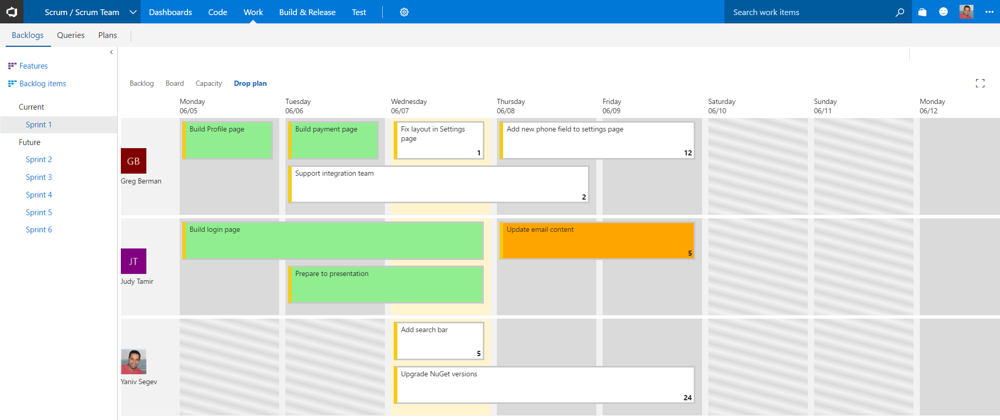
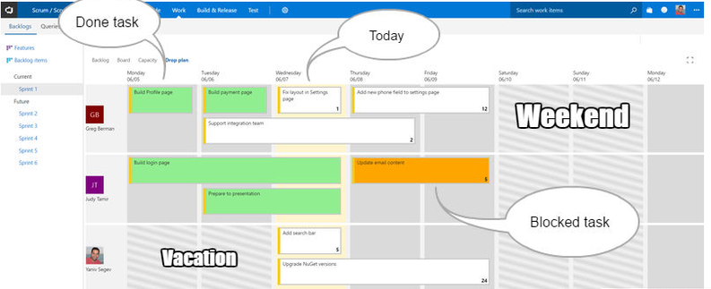
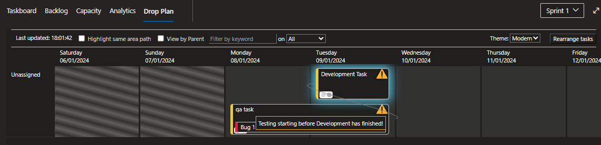
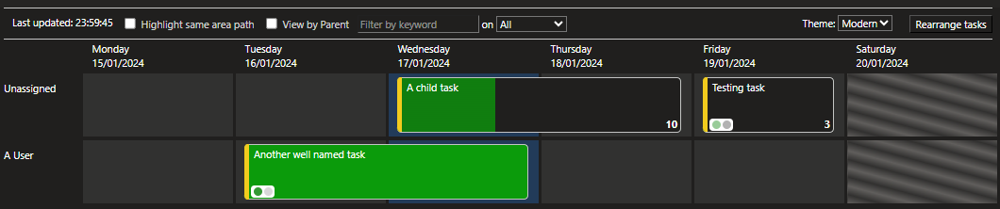
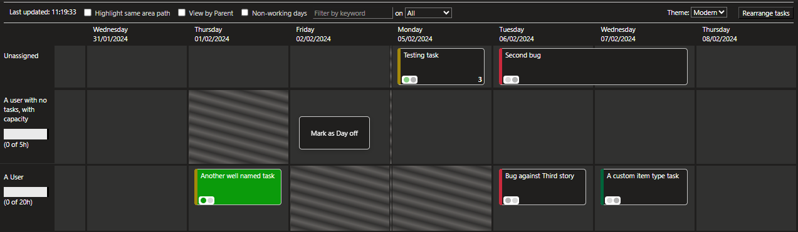

# Plan and track your work in a sprint #

Sprint Drop Plan is an organizational tool that helps team members to sync their tasks by visualizing work status and dependencies on a sprint-based calendar.

## Review your sprint plan ##

## Arrange and track sprint progress ##

- Arrange tasks by simple drag & drop on the calendar.
- Visualize your progress by colors on the calendar.
- Highlight tasks on the same requirement by hovering on one of them.

- See when tasks are planned out of sequence (e.g., Testing before Development.)

- If you use Effort (Hours), you can see the progress of individual tasks.

- If you assign capacity to a user they will show on the calendar even if they have no tasks
- You can select to see/hide team non-working days (configured weekends/team days off)
- You can right click on a cell to add/remove it as a "Day off"
- Tasks on the plan will use the configured colour of the task, so that you can easily tell the difference between bugs/tasks/any custom task types.

## Quick steps to get started ##

1. Navigate to your sprint.
2. Click on the "Drop plan" tab.
3. Start organizing your tasks.

An optional step is Configuring your project activity order in Drop Plan Settings.  
Drop Plan settings are available from "Project Settings" under "Extensions".

Happy coding :-)

## Change Log ##

### 2.1.1 -> 2.1.5 ###

BugFixes:

1. Improving error handling on saving
2. Settings weren't scoped to project (#113)
3. Related tasks with more than 11 siblings spill the status outside the item.

### 2.1.0 ###

1. See task type from icon or colour (theme dependant) (#59)
2. Add option to hide team non-working days (e.g., hide weekends/national holidays) (#9, #57)
3. See all people on the plan with allocated capacity. (#73)
4. Add ability to right click to add/remove individual team members as on leave for that day.
5. Add ability to use Stories instead of Tasks on the Drop Plan for teams that do not use the lowest level of work item type.
6. Bugfixes #111, Not showing avatar image.

### 2.0.1 -> 2.0.14 ###

Bugfixes #75, #84, #98, #97, #102, #106, #108, #110.

### 2.0.0 ###

1. Add Dark theme support with new theme "Modern".
2. Add task completion progress.
3. Add warning for tasks where the activities are out of order sequence (E.g., Testing before Development).
4. Add warning for Tasks that are planned out of parent sequence.
5. Add ability to filter on Activity and tags (#89)
6. Use all the configured capacity for a user (#80)
7. Reduce the number of calls the Plan makes when active, and vastly reduce when the plan is in the background (#63)
8. Other bugfixes.
9. Updated dependences to latest.
